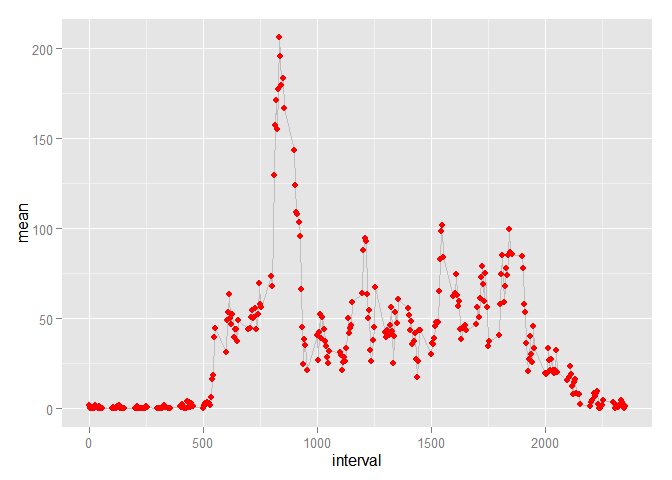
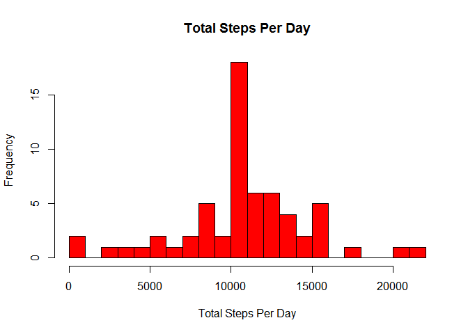
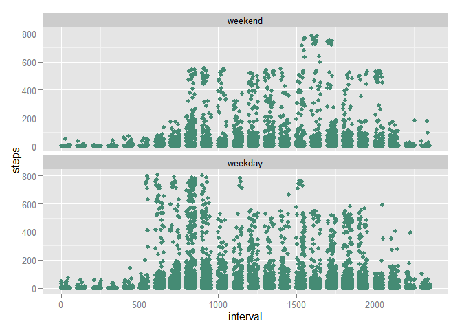

# Reproducible Research: Peer Assessment 1

## Loading and preprocessing the data

```r
library(dplyr)
library(lubridate)
library(ggplot2)
```


```r
setwd("..")
act <- read.csv("activity.csv")
summary(act)
```

```
##      steps                date          interval     
##  Min.   :  0.00   2012-10-01:  288   Min.   :   0.0  
##  1st Qu.:  0.00   2012-10-02:  288   1st Qu.: 588.8  
##  Median :  0.00   2012-10-03:  288   Median :1177.5  
##  Mean   : 37.38   2012-10-04:  288   Mean   :1177.5  
##  3rd Qu.: 12.00   2012-10-05:  288   3rd Qu.:1766.2  
##  Max.   :806.00   2012-10-06:  288   Max.   :2355.0  
##  NA's   :2304     (Other)   :15840
```


## What is mean total number of steps taken per day?

```r
act_bydate <- act %>%
  select(1,2) %>%
  group_by(date) %>%
  summarise_each(funs(sum, mean)) %>%
  na.omit()

median(act_bydate$sum)
```

```
## [1] 10765
```

```r
mean(act_bydate$sum)
```

```
## [1] 10766.19
```


```r
hist(act_bydate$sum, main="Total Steps Per Day", xlab="Steps", col="red", breaks=20)
```

 


## What is the average daily activity pattern?

```r
steps_by_interval <- act %>%
  select(1,3) %>%
  na.omit %>%
  group_by(interval) %>%
  summarise_each(funs(sum,mean))

ggplot(steps_by_interval, aes(x=interval, y=mean))+geom_line(color="grey")+geom_point(color="red") 
```

 

```r
# find the interval that averages the most steps (across all days)
max_steps_per_int = steps_by_interval %>% filter(mean == max(mean))
max_steps_per_int$interval # interval that averages the most steps
```

```
## [1] 835
```

```r
max_steps_per_int$mean #average steps for that interval```
```

```
## [1] 206.1698
```


## Imputing missing values

```r
#count rows with na in steps column
act %>% filter(is.na(steps)) %>% count()
```

```
## Source: local data frame [1 x 1]
## 
##      n
## 1 2304
```


```r
# create a dataframe from the original, but the NA values are replaced with
# the mean of non-NA steps for that same interval, averaged across all days
imp_activity <- act %>%
  group_by(interval) %>%
  mutate(steps= replace(steps, is.na(steps), mean(steps, na.rm=TRUE)))

steps_by_day <- imp_activity %>%
  select(steps, date) %>%
  group_by(date) %>%
  summarise_each(funs(sum,mean))

median(steps_by_day$steps_sum)
```

```
## [1] 10766.19
```

```r
mean(steps_by_day$steps_sum)
```

```
## [1] 10766.19
```

```r
hist(steps_by_day$steps_sum, main="Total Steps Per Day", xlab="Total Steps Per Day", col="red", breaks=20)
```

 


## Are there differences in activity patterns between weekdays and weekends?

```r
steps_by_weekday <- imp_activity %>% mutate(weekday = weekdays(as.Date(date)))

steps_by_weekday$weekpart <- factor((wday(steps_by_weekday$date) %in% c(2,3,4,5,6)),
                                    levels=c(FALSE, TRUE),
                                    labels=c('weekend', 'weekday'))


ggplot(steps_by_weekday, aes(interval,steps))+geom_point(color="aquamarine4")+facet_wrap(~weekpart, nrow=2)
```

 

